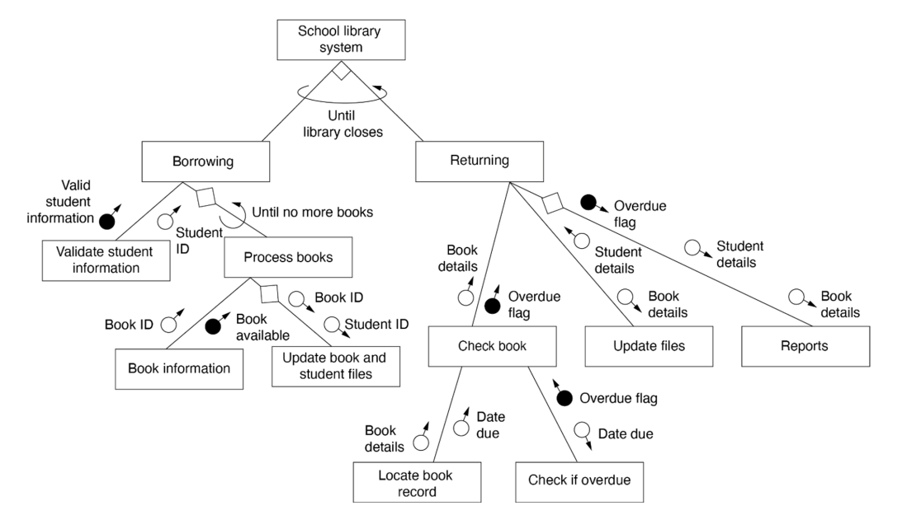

### Question (1 mark)  
**What is encapsulation in object-oriented programming?**

- [ ] Organising code into reusable functions  
- [ ] Restricting direct access to an object’s data and only allowing changes through methods  
- [ ] Creating multiple functions with the same name but different parameters  
- [ ] Designing a class to inherit methods and attributes from another class  

---

### Question 2 (1 mark)
**What is the purpose of the FTP protocol in web communication?**

- [ ] To send emails using port 443  
- [ ] To transfer files over a network using port 21  
- [ ] To stream video content using port 25  
- [ ] To encrypt web traffic using port 80  

---

### Question 3 (1 mark)  
**Match each data type to an appropriate example value.**

| Example Value | Data Type |
|-----------------------------|------------|
| `true`                      | ??????     |
| `"Australia"`               | ??????     |
| `47.8`                      | ??????     |
| `2001`                      | ??????     |

Options: `Integer`, `Boolean`, `String`, `Float`

---

### Question 4 (1 mark)  
**Which of the following best protects a web server from SQL injection attacks?**

- [ ] Limiting file upload size  
- [ ] Using strong user passwords  
- [ ] Performing client-side validation  
- [ ] Using prepared statements with parameterised queries  

---

### Question 5 (1 mark)  
**Which of the following are common goals of software testing? (More than one may be selected.)**

- [ ] To ensure code is written in Python  
- [ ] To check the program runs without errors  
- [ ] To verify the program meets user requirements  
- [ ] To reduce the number of functions in the program  
- [ ] To identify logic and runtime errors  

---

### Question 6 (1 mark)  
**Consider the following Python code:**

```python
for i in range(1, 6):
    print(i)
```

**Which of the following pseudocode lines correctly represents the loop above?**

- [ ] FOR i = 0 TO 5  
- [ ] FOR i = 1 TO 5  
- [ ] FOR i = 1 TO 6  
- [ ] FOR i = 0 TO 4  

---

### Question 7 (2 marks)  
**Rearrange the steps of the Software Development Life Cycle (SDLC) into the correct order.**

Steps to arrange:
- Design  
- Deployment  
- Testing  
- Requirements definition  
- Maintenance  
- Development  
- Planning  
- Integration  

---

### Question 8 (2 marks)  
**Rearrange the following pseudocode steps to create a working login sequence.**

```
BEGIN Login
[...steps...]
END Login
```

Steps to arrange:
- ELSE DISPLAY "Access denied"  
- READ username  
- ENDIF  
- DISPLAY "Login successful"  
- READ password  
- IF username AND password are correct THEN  

---

### Question 9 (1 mark)  
**Which of the following best describes the *Integrity* aspect of the CIA triad in cybersecurity?**

- [ ] Ensuring data is only accessible to authorised users  
- [ ] Ensuring systems are always available when needed  
- [ ] Ensuring data is accurate and has not been tampered with  
- [ ] Ensuring users can update data from any location  

---

### Question 10 (3 marks)  
**Consider the following pseudocode algorithm:**

```
BEGIN gradeCalculator
    READ mark
    IF mark >= 90 THEN
        grade = "A"
    ELSE IF mark >= 70 THEN
        grade = "B"
    ELSE IF mark >= 50 THEN
        grade = "C"
    ELSE
        grade = "D"
    ENDIF
    DISPLAY grade
END gradeCalculator
```

**Provide test data that will test this algorithm.**

| Input (mark)     | Expected output (grade)  |
|------------------|--------------------------|
|       1:         |                          |
|       2:         |                          |
|       3:         |                          |
|       4:         |                          |

---

### Question 11 (2 marks)  
**Which of the following are examples of Cross-Site Scripting (XSS) vulnerabilities? (More than one may be selected.)**

- [ ] A user inputs `<script>` code into a form and it executes in another user’s browser  
- [ ] Passwords are stored in plain text on the server  
- [ ] A user clicks a link in a comment and it runs JavaScript that steals cookies  
- [ ] An attacker intercepts login data over an unsecured Wi-Fi connection  
- [ ] A website allows users to upload profile bios without sanitising HTML input  

---

### Question 12 (6 marks)

**(a) Compare the agile and waterfall approaches to software development.**  
(2 marks – Max 50 words)

[Your answer here]

**(b) Explain what a WAgile approach is and when it might be useful.**  
(2 marks – Max 50 words)

[Your answer here]

**(c) Why is it important for teams to choose the right development approach?**  
(2 marks – Max 50 words)

[Your answer here]

---

### Question 13 (3 marks)  
**Explain how WCAG (Web Content Accessibility Guidelines) has influenced modern web design using HTML and CSS.  
Include two specific examples in your answer.**  
(Max 75 words)

[Your answer here]

---

### Question 14 (6 marks)



**Refer to this structure chart of a School Library System. Answer the following questions:**

**(a)** Explain how control structures such as loops and decisions are represented in the chart. Refer to specific examples from the diagram.  
(3 marks)  
[Your answer here]

**(b)** Describe what happens when an overdue book is returned.
(3 marks)  
[Your answer here]

---

### Question 15 (3 marks)  
**The table below lists information about customer accounts.  
Write an SQL query to display all customers who signed up before 2022 and have an active subscription.**  

#### Customers

| CustomerID | Name        | SignupYear | ActiveSubscription |
|------------|-------------|------------|---------------------|
| C001       | Aliyah Chen | 2020       | TRUE                |
| C002       | Jacob King  | 2023       | FALSE               |
| C003       | Aria Singh  | 2021       | TRUE                |
| C004       | Leo Tran    | 2022       | TRUE                |
| C005       | Mia Brown   | 2019       | TRUE                |

**Write your SQL query here:**
[Your answer here]

---

### Question 16 (3 marks)  
**Compare the use cases for the following machine learning algorithms:**  
- Logistic Regression  
- Linear Regression  
- K-Nearest Neighbour (KNN)  

**Include one example scenario where each would be most suitable.**  
(Max 75 words)

[Your answer here]

---

### Question 17 (3 marks)  
**The following database tables store data for a mobile game app:**

#### Players  
| PlayerID | Name     | Age | Country |
|----------|----------|-----|---------|
| P001     | Jack     | 15  | AU      |
| P002     | Riley    | 16  | NZ      |
| P003     | Sienna   | 17  | AU      |
| P004     | Oliver   | 14  | AU      |

#### Scores  
| ScoreID | PlayerID | Points |
|---------|----------|--------|
| S001    | P001     | 1500   |
| S002    | P003     | 1800   |
| S003    | P004     | 900    |
| S004    | P002     | 1200   |

**Write an SQL query to show the names of Australian players who scored more than 1000 points.**

[Your answer here]

---

### Question 18 (6 marks)  
**A website allows users to register with a username. The username must meet these rules:**

1. It must start with a letter  
2. It must be at least 6 characters long  
3. It can only include letters and numbers  

**(a) Explain how form validation can help prevent invalid usernames being saved.**  
(3 marks – Max 75 words)

[Your answer here]

**(b) Write a Python function that returns `True` if a username is valid, or `False` if not.**  
(3 marks)

```python
def is_valid_username(username):
    # Your code here
```

---

### Question 19 (4 marks)  
**Arrange the following steps in the correct order to describe how a simple SSL/TLS handshake works between a browser and a web server.**

Steps to arrange:  
- Server and client begin encrypted communication  
- Server sends its digital certificate to the client 
- Client requests a secure connection to the server   
- Client verifies the certificate and creates a session key  

---

### Question 20 (4 marks)  
**AI models can sometimes produce unfair or biased outcomes.**

**(a) What is bias in the context of an AI model?**  
(1 mark)

[Your answer here]

**(b) Give one real-world example where bias in AI could negatively impact people.**  
(1 mark)

[Your answer here]

**(c) Describe two ways developers can reduce bias in a machine learning system.**  
(2 marks)

[Your answer here]

---

### Question 21 (6 marks)  
**A school is designing a class diagram for its online library system.**

Each **Book** has:
- A title  
- An ISBN number  
- A category (e.g. "Fiction", "Non-Fiction", "Reference")  
- Assume there is only one of each book in this library

Each **Student**:
- Has a name and student ID  
- Can borrow multiple books  

Each **Loan**:
- A student can loan books
- A loan records the due date and whether the book has been returned 
- Can have many books in one loan

**Draw a UML class diagram in markdown format that models this system.**  
Include class names, attributes, and relationships.

---

### Question 22 (5 marks)  
**Hashing and encryption are both used to protect data, but in different ways.**

**(a) Describe two key differences between hashing and encryption.**  
(2 marks)

[Your answer here]

**(b) Give one example of when hashing should be used, and one example of when encryption should be used.**  
(2 marks)

[Your answer here]

**(c) Explain the difference between symmetric and asymmetric encryption.**  
(1 mark)

[Your answer here]

---

### Question 23 (4 marks)  
**A local business is deciding whether to use a Content Management System (CMS) for its new website.**  

**(a) List two advantages and one disadvantage of using a CMS.**  
(3 marks)  
[Your answer here]

**(b) Give one example of a situation where using a CMS would be the best choice. Justify your answer.**  
(1 mark)  
[Your answer here]

---

### Question 24 (4 marks)  
**Open-source software is often chosen by developers over commercial alternatives.**  

**(a) Give two reasons why a team might choose to use open-source software for a project.**  
(2 marks)  
[Your answer here]

**(b) What is one possible risk of using open-source software? How can a development team reduce this risk?**  
(2 marks)  
[Your answer here]

---

### Question 25 (8 marks)  
**Streaming platforms like Netflix and Spotify rely on metadata and big data to power their services.**  

**Write an extended response (max 300 words) that explains how metadata and big data are used by these platforms to improve user experience.  
In your answer, refer to the role of:**

- Real-time data ingestion  
- Personalisation and recommendation systems  
- The architecture that supports these features

[Your answer here]

---

### Question 26 (8 marks)  
**As software systems collect and store more user data, developers must consider privacy laws and ethical responsibilities.**  

**Write an extended response (max 300 words) that explains the importance of data privacy in software engineering.  
In your answer, refer to:**  
- Legal responsibilities, such as the Australian Privacy Principles (APPs)  
- How software engineers can protect user data  
- The ethical implications of data misuse  
- One real-world example of a privacy breach and its consequences  

[Your answer here]