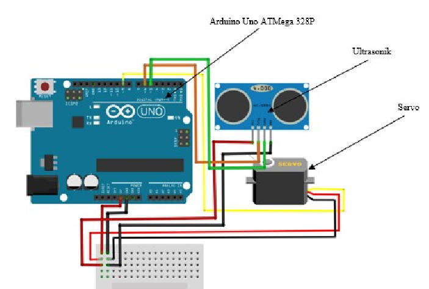

# Understanding Mechatronic Hardware and Software Part 2 - HSC Software Engineering Revision Notes

## 1. Understanding Data in Mechatronic Systems
Mechatronic systems rely on **different types of data** to function effectively. This data is used for **diagnostics, system optimization, and automation**.

### **1.1 Types of Data in Mechatronic Systems**
| **Data Type** | **Purpose** | **Example** |
|--------------|------------|-------------|
| **Diagnostic Data** | Detects faults and predicts failures | Robot arm temperature and motor status logs |
| **Optimisation Data** | Improves system performance | Speed adjustments in automated conveyor belts |
| **Real-Time Sensor Data** | Provides input for decision-making | Distance sensors in self-driving cars |
| **User Input Data** | Allows user customization and control | Touchscreen input for robotic prosthetics |

### **1.2 Example: Using Sensor Data for Diagnostics in Python**
```python
import random

def get_temperature():
    return random.uniform(20.0, 80.0)  # Simulated sensor reading

for _ in range(5):
    temp = get_temperature()
    if temp > 70:
        print(f"Warning: High temperature detected ({temp}°C)")
    else:
        print(f"System stable: {temp}°C")
```

---

## 2. Software for Controlling Mechatronic System Interactions
Software controls **motion, degrees of freedom, subsystem integration, and sensor-actuator coordination**.

### **2.1 Motion Constraints**
- Limits the **speed, acceleration, and range** of movement.
- **Example:** Preventing a robotic arm from moving beyond **its safe range**.

#### **Example: Motion Constraint in a Robotic Arm (Pseudocode)**
```
BEGIN
    SET min_angle = 0
    SET max_angle = 180
    INPUT desired_angle
    IF desired_angle < min_angle OR desired_angle > max_angle THEN
        PRINT "Error: Angle out of range"
    ELSE
        MOVE arm TO desired_angle
END
```

---

### **2.2 Degrees of Freedom (DOF)**
- The **number of independent movements** a system can make.
- **Example:** A robotic arm with 6 DOF can move in multiple directions (up/down, rotate, extend/retract).

| **System** | **Degrees of Freedom** |
|-----------|---------------------|
| **Door Hinge** | 1 DOF (open/close) |
| **Car Steering Wheel** | 1 DOF (rotation) |
| **Robotic Arm** | 6 DOF (complex movement) |

---

### **2.3 Combining Subsystems**
- **Mechatronic systems integrate multiple subsystems**.
- **Example:** A drone consists of:
  - **Navigation Subsystem** (GPS, IMU sensors)
  - **Control Subsystem** (flight controller, propeller motors)
  - **Communication Subsystem** (remote control, Wi-Fi connection)

#### **Example: Python Code for Combining Multiple Subsystems**
```python
class Navigation:
    def get_position(self):
        return "GPS Coordinates: 33.8688° S, 151.2093° E"

class MotorControl:
    def adjust_speed(self, speed):
        return f"Setting motor speed to {speed}%"

class Drone:
    def __init__(self):
        self.navigation = Navigation()
        self.motor = MotorControl()

    def fly(self):
        print(self.navigation.get_position())
        print(self.motor.adjust_speed(75))

# Running the drone system
drone = Drone()
drone.fly()
```

---

### **2.4 Combining Sensors, Actuators, and End Effectors**
- Sensors **gather input**, actuators **perform actions**, and end effectors **interact with objects**.
- **Example:** A robotic gripper uses:
  - **Pressure sensors** to detect grip strength.
  - **Electric motors** to move the fingers.
  - **Soft rubber tips** to avoid damaging objects.

#### **Example: Combining a Sensor with an Actuator (Pseudocode)**
```
BEGIN
    READ pressure_sensor_value
    IF object_detected THEN
        ACTIVATE robotic_gripper
    ELSE
        RELEASE robotic_gripper
END
```

---

## 3. Power, Battery, and Material Requirements for Mechatronic Components
### **3.1 Power and Battery Considerations**
| **Component** | **Power Source** | **Example** |
|--------------|----------------|-------------|
| **Microcontrollers** | 5V USB, lithium battery | Arduino board |
| **Motors** | DC power supply | Electric car motors |
| **Sensors** | Low-power voltage (3.3V-5V) | Infrared motion sensors |

- **Energy efficiency is critical** for mobile robots and drones to extend battery life.

### **3.2 Material Considerations**
| **Component** | **Material Used** | **Why It’s Used** |
|--------------|-----------------|----------------|
| **Robotic Arm** | Aluminum, carbon fiber | Lightweight and durable |
| **End Effectors** | Rubber, silicone | Provides better grip and avoids damage |
| **Microcontrollers** | PCB (Printed Circuit Board) | Compact and conductive |

---

## 4. Developing Wiring Diagrams for Mechatronic Systems
Wiring diagrams **show electrical connections** between components.

### **Example**


---

## 5. Specialist Requirements for Mechatronic Systems for People with Disabilities
Mechatronic systems **enhance accessibility and improve mobility**.

### **5.1 Considerations for Accessibility**
| **Feature** | **Benefit** |
|------------|------------|
| **Voice Control** | Allows hands-free operation |
| **Gesture-Based Controls** | Helps users with mobility impairments |
| **Adaptive Speed and Sensitivity** | Ensures comfort and safety |

### **5.2 Examples of Assistive Mechatronics**
| **Technology** | **Function** |
|--------------|-------------|
| **Prosthetic Limbs** | Respond to muscle signals for movement |
| **Exoskeletons** | Help people with mobility impairments walk |
| **Eye-Tracking Software** | Allows communication for people with paralysis |

#### **Example: AI-Powered Prosthetic Hand (Pseudocode)**
```
BEGIN
    READ muscle sensor input
    IF muscle detected movement THEN
        ACTIVATE prosthetic fingers
    ELSE
        RELAX fingers
END
```

